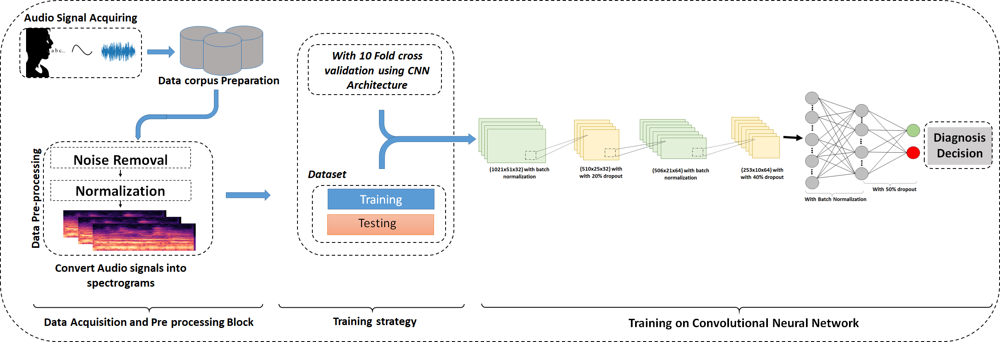
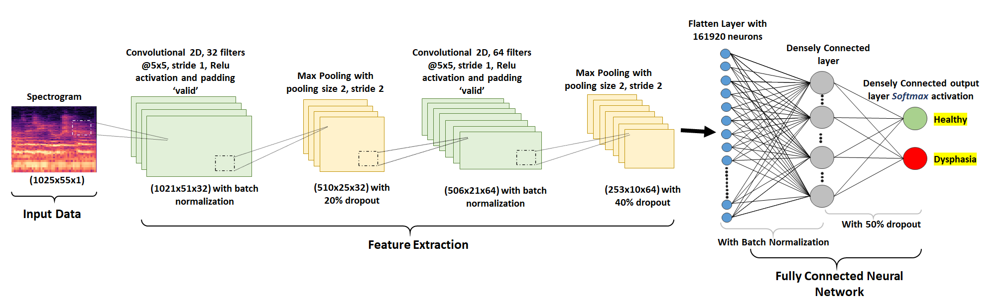
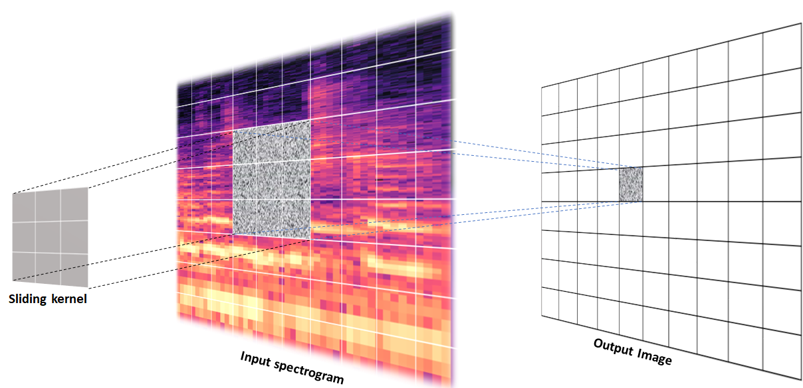

# Dysphasia detection using deep learning and spectrogram

## Description
In the proposed work, raw audio data is processed using Short time Fourier transform and converted to decibel (dB) scaled spectrograms which are classified using the proposed convolutional neural network (CNN). This approach consists of utterances that contained seven types of vocabulary (vowels, consonant and different syllable Isolated words). A rigorous analysis based on different agegroup was performed and a 10-fold Cross-Validation (CV) was done to test the accuracy of the classifier. A comprehensive experimental test reveals that 99.09 % of the children are correctly diagnosed by the proposed framework, which is superior when compared to state-of-the-art methods.

## Data Availability
The corpus (database) [2] created at LANNA (Laboratory of Artificial Neural Network Applications) in the Department of Circuit Theory of the FEE CTU in Prague is specialized and intended mostly for medical research.

Data are available from Figshare: https://dx.doi.org/10.6084/m9.figshare.2360626.

## Workflow

## CNN diagram

## Kernel Sliding

## Citation

If you use [Dysphasia SLI Analysis](https://github.com/manojkaushik/Dysphasia-detection-using-deep-learning) code in your research, we would appreciate a citation to the original paper:

"*Kaushik, Manoj, et al. "SLINet: Dysphasia detection in children using deep neural network." Biomedical Signal Processing and Control 68 (2021): 102798.*"

"*Kaushik, M., Baghel, N., Burget, R., Travieso, C. M., & Dutta, M. K. (2021). SLINet: Dysphasia detection in children using deep neural network. Biomedical Signal Processing and Control, 68, 102798.*"

"*Kaushik, Manoj, Neeraj Baghel, Radim Burget, Carlos M. Travieso, and Malay Kishore Dutta. "SLINet: Dysphasia detection in children using deep neural network." Biomedical Signal Processing and Control 68 (2021): 102798.*"

"*Kaushik, M., Baghel, N., Burget, R., Travieso, C.M. and Dutta, M.K., 2021. SLINet: Dysphasia detection in children using deep neural network. Biomedical Signal Processing and Control, 68, p.102798.*"

"*Kaushik M, Baghel N, Burget R, Travieso CM, Dutta MK. SLINet: Dysphasia detection in children using deep neural network. Biomedical Signal Processing and Control. 2021 Jul 1;68:102798.*"